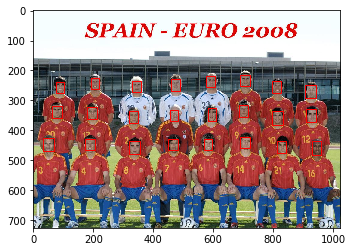
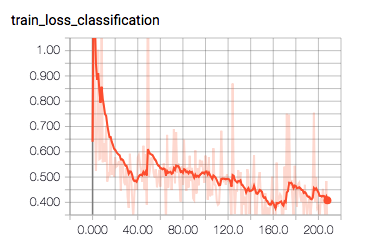

# sfd.pytorch
sfd implementation for face recognition in pytorch. Paper at: [SFD: Single Shot Scale-invariant Face Detector](https://arxiv.org/abs/1708.05237)

## Need help :sweat_drops:

This repo is still under developing, any issue or pull request is very welcome. Currently the weights given bellow achieve 0.7 mAP on all the validation set of wider face. I'm still training it with my poor 1080ti. Anyone with more computing resources wants to train this please open an issue to get in touched.

## Requirements

* Python 3.6
* Pytorch 0.4
* TensorBoard(Optional)

## TODOs

- [x] Training on wider faces.
- [x] Inference tools and API.
- [x] Non-maximum suppression at reference.
- [x] TensorBoard supported.
- [x] Evaluation.
- [x] Image augmentation.
- [ ] Multi-class detection.
## Detection

The `detector.py` is executable and programmable, see `inference.ipynb` for a quick look at how to use the detector API. Using the following command for directly use it in the command line.

```
python3 detector.py --image ./image/test.jpg --model ./epoch_204.pth.tar
```

The trained model `epoch_204.pth.tar` can be downloaded from [Baidu Yun](https://pan.baidu.com/s/1n2TzKIWP0qRgM6zgCE98Lw) or [Google Drive](https://drive.google.com/open?id=1WPX-sjEQdIQ0COnxBtlM_mLIhN652UQq).

The detector will draw bounding boxes and the result is showing bellow



## Train

To train with the [wider_face dataset](http://mmlab.ie.cuhk.edu.hk/projects/WIDERFace/), download and extract everything in one directory named `wider_face`. The file trees should then look like this,
```
└── wider_face
    ├── Submission_example.zip
    ├── wider_face_split
    │   ├── readme.txt
    │   ├── wider_face_test_filelist.txt
    │   ├── wider_face_test.mat
    │   ├── wider_face_train_bbx_gt.txt
    │   ├── wider_face_train.mat
    │   ├── wider_face_val_bbx_gt.txt
    │   └── wider_face_val.mat
    ├── wider_face_split.zip
    ├── WIDER_test
    │   └── images
    ├── WIDER_test.zip
    ├── WIDER_train
    │   └── images
    ├── WIDER_train.zip
    ├── WIDER_val
    │   └── images
    └── WIDER_val.zip
```
In the `config.py`, set the `DATASET_DIR` to the path of `wider_face`, and set the `LOG_DIR` to whatever but a existed directory. Now it's ready to train with the following command,

```
python3 main.py # there is no stdout
```

The training log is in `LOG_DIR/log.txt`, and models will be saved at `LOG_DIR/models/epoch_xx.pth`. There are many options in `config.py`(including learning rate or resumption) for you to tweak to get a better model.


### TensorBoard

If you have `TensorBoard` installed, set `TENSOR_BOARD_ENABLED` to True in the `config.py`, you can use the following command to quickly start the TensorBoard server.

```
./bin/tensorboard
```

To visualize how the loss is changing.


